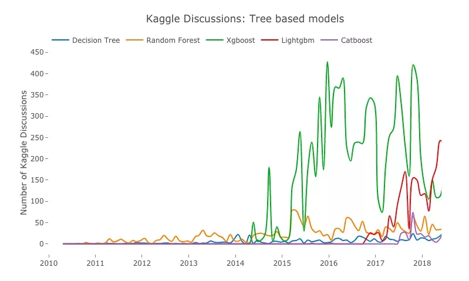
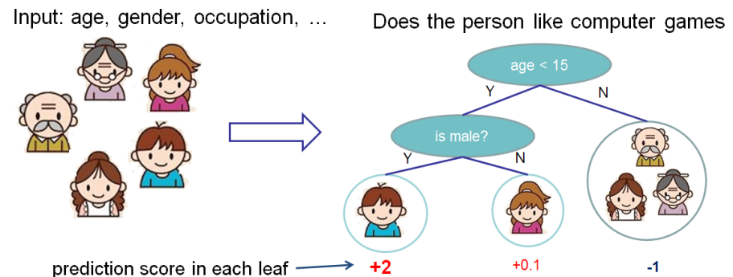
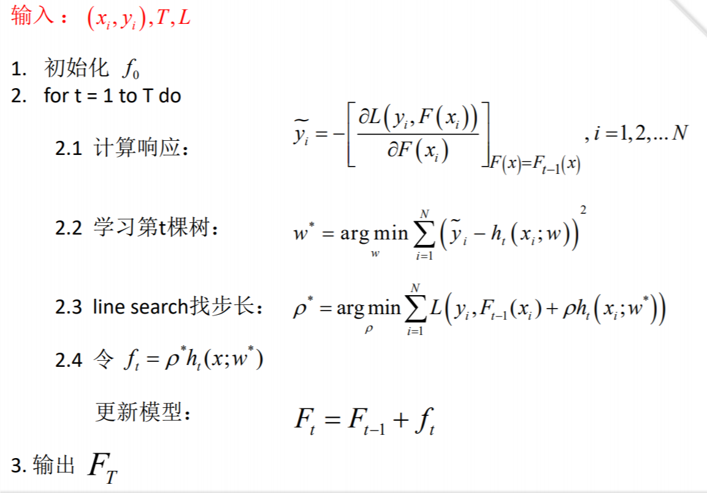
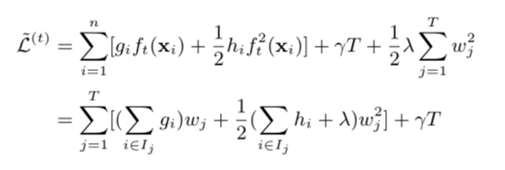
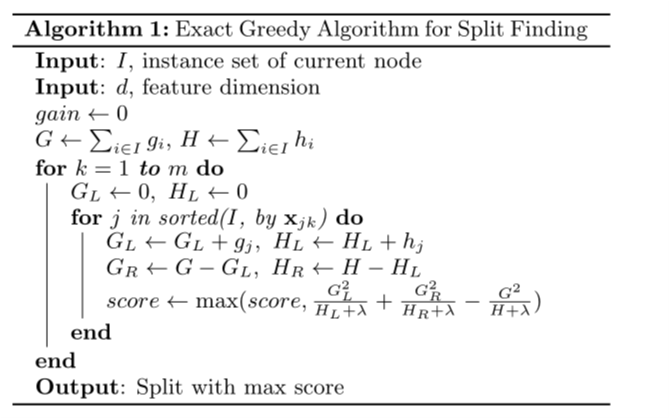
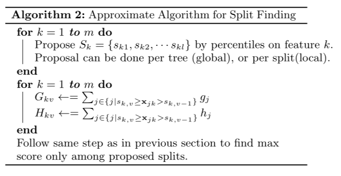

#	==调研报告==

​																		**Oct 29 2018  nlh**


在数据挖掘竞赛中，基于GBDT(gradient boosted decision tree)算法，主要为xgb,lgb算法非常重要。本调研报告涉及xgb(XGBoost)相关算法介绍。

通过介绍boosting , gradient boosting tree引出xgb。


#### Introduction

> Kaggle是全球最大数据建模和数据分析竞赛平台，也是检验个人水平的最佳舞台。现如今，随着社会对机器学习人才的需求提高，在Kaggle上刷到过前5%、10%也成了应聘的一个硬指标。考虑到Kaggle的权威性和受欢迎度，这么多年来，这个平台的数据应该能体现整个数据科学领域的发展轨迹。

下图展示了xgb算法在近些年来在kaggle比赛中重要地位。当然，随着Lightgbm的提出，xgb比重下滑。




#### related work

> ”传统决策树的启发式，指的是树的内部节点分裂时候的算法,（比如信息增益）
>
> 而xgboost的objective式的决策，是指在生长出一颗新树时候的算法，而树的内部还是启发式的


> - 传统GBDT以CART作为基分类器，xgboost还支持线性分类器，这个时候xgboost相当于带L1和L2正则化项的逻辑斯蒂回归（分类问题）或者线性回归（回归问题）。
>
> - xgboost工具支持并行。boosting不是一种串行的结构吗?怎么并行的？注意xgboost的并行不是tree粒度的并行，xgboost也是一次迭代完才能进行下一次迭代的（第t次迭代的代价函数里包含了前面t-1次迭代的预测值）。xgboost的并行是在特征粒度上的。我们知道，决策树的学习最耗时的一个步骤就是对特征的值进行排序（因为要确定最佳分割点），xgboost在训练之前，预先对数据进行了排序，然后保存为block结构，后面的迭代中重复地使用这个结构，大大减小计算量。这个block结构也使得并行成为了可能，在进行节点的分裂时，需要计算每个特征的增益，最终选增益最大的那个特征去做分裂，那么各个特征的增益计算就可以开多线程进行。
>
> - 可并行的近似直方图算法。树节点在进行分裂时，我们需要计算每个特征的每个分割点对应的增益，即用贪心法枚举所有可能的分割点。当数据无法一次载入内存或者在分布式情况下，贪心算法效率就会变得很低，所以xgboost还提出了一种可并行的近似直方图算法，用于高效地生成候选的分割点。


---


### <span id="jump"> boosting方法</span>

由于所要介绍的算法有关boosting方法，故可以简单了解boosting.

an example:

某个boosting算法可以表示为

​					$f(x)=\omega_0+\sum\limits_{m=1}^{M} \omega_m \phi_m $

​		$\omega$是权重，$\phi$是弱回归器的集合，实际上是一个加法模型(即基函数的线性组合)


我们对输入数据做一个极小化损失函数:

​		$(\beta_m,\gamma_m)=arg\min_{\beta,\gamma}\sum\limits_{i=1}^{N}L(y_i,f_{m-1}(x_i)+\beta b(x_i ;\gamma)) $

更新$\beta_m,\gamma_m$后 ,计算$f_m(x)$

​		$f_m(x)=f_{m-1}(x)+\beta_mb(x;\gamma_m)$				(初值$f_0(x)=0$)

最终得到输出加法模型$f(x)$

​		$f(x)=f_M(x)=\sum\limits_{m=1}^M\beta_mb(x;\gamma_m)$			b即为上面的$\phi$弱分类器

**在我理解,boosting方法主要就是将最优的解视为一个加法模型.**

**而gradient boosting 与其类似,只不过在更新参数时，选取梯度的方向来找到最优结果。**


---
### gradient boosting tree

> it equals GBDT algorithm.

本部分主要参考[ppt1](https://homes.cs.washington.edu/~tqchen/pdf/BoostedTree.pdf) && [ppt2](http://wepon.me/files/gbdt.pdf).

介绍gradient boosting tree前，我们先来看下监督学习。

在监督学习中,我们会用输入$x_i$来预测$y_i$.

> ​	对于线性模型,我们可以有这样的预测函数
>
> ​			$\hat y_i=\sum\limits_j\omega_jx_{ij}$	
>
> ​	然后常规地构造obejective function:	$Obj(\Theta)=L(\Theta)+\Omega(\Theta) $即可


当我们尝试用树模型来研究这种监督学习问题时,可以像下图一样，对某个问题生成决策树，并对不同分支赋不同权值。





由于单个树对于较大特征的处理会导致深度过深，影响性能。所以可以利用树的集合来完成上述的想法.	


换做数学语言描述上述过程,即为

​		$\hat y_i=\sum\limits_{k=1}^Kf_k(x_i), f_k\in F$	$F=\{f(x)=\omega_{q(x)} \}(q:R^m->T,\omega \in R^T)$

​			K为树的个数,F is the space of regression trees ,(我理解为,每棵树中元素所属类的权值)

​			T为树的叶节点数量，因此每个$f_k$对应一个独立树结构的q以及权重$\omega $.

基于之前 [boosting _example](#jump) ,我们给出第t轮迭代得到的模型预测值(即把前t-1轮预测展开,相加)
$$
\hat y_i^{(0)} = 0 \\  
	\hat y_i^{(1)}=f_1(x_i)=\hat y_i^{(0)}+f_1(x_i)\\
				...\\
		\hat y_i^{(t)}=\sum\limits_{k=1}^tf_k(x_i)=\hat y_i^{(t-1)}+f_t(x_i)
$$


那么对原问题求解(更好地预测y)可以转化为如何找到更优的树.(即找到效果更好的$f_i$)

这就引出了下面tree boosting 算法思想的描述.(当然为了引出xgb,我们主要讲的是gradient的想法)

>boosted Tree算法简要描述：
>不断地添加树，不断地进行特征分裂来生长一棵树。
>每次添加一个树，其实是学习一个新函数，去拟合上次预测的残差。
>一个树是这样生长的，挑选一个最佳特征的最佳分裂点，来进行特征分裂。[source](https://zhuanlan.zhihu.com/p/26214650)

那么我们该选取怎样的函数去处理?

我们下面来看看具体的算法是怎么做的。

[Gradient Boosting Tree 算法原理](https://statweb.stanford.edu/~jhf/ftp/trebst.pdf)	

​	F is defined as :

​		$F(x;w)=\sum\limits_{t=0}^T\alpha_th_t(x;w_t)=\sum\limits_{t=0}^Tf_t(x;w_t)​$	

​	where x is input data ,h is regression tree, w is parameter, $\alpha$ is the weight of every tree.




​		

​	**在2.1步中，$\widetilde y$选取一阶导数的逼近。**

​	**在2.2步中，对权重$ \omega $的选取采用了最小损失函数的方法，试图对NP hard利用greedy strategy 寻求局部最优**

​	*在2.3步中，$\rho $主要涉及学习率的问题。2.4步中，即为加法模型的体现*


总的来说，gbdt算法在T次迭代中，每次迭代都计算出加法模型的loss function在各方向上的梯度(注意为L只展开到一阶导数)，于是便计算regression tree的权重作用与y差距最小的权重。选取适当学习率，更新模型。


## [XGBoost](https://www.kdd.org/kdd2016/papers/files/rfp0697-chenAemb.pdf)

清楚了gbdt算法大概流程，下面我们来着重看看xgb的优势体现在哪里。

1.

对于obejective function,在gbdt基础上，新增正则项处理。。

​					$\widetilde {Obj^{(t)}}=\sum\limits_{i=1}^nl(y_i,\hat y_i^t)+\sum\limits_{i=1}^t\Omega(f_i) $	①			(wave lines mean approximation)

​				where $\Omega(f_t)=\gamma T+\frac 12 \lambda\sum_{j=1}^T\omega_j^2$  ; 	T 指叶的数目，右边为L2 norm.

​					

> 在代价函数中，加入正则项。从Bias-variance tradeoff角度来讲，正则项降低了模型的variance，使学习出来的模型更加简单，防止过拟合，降低模型的误差。	


2.

这里尝试用MSE的方法来处理Loss function,将①式代入

这里我们同样采用了gradient tree boosting的方式，但泰勒展开到二阶

​				$	 \hat {Obj^{t}}=\sum\limits_{i=1}^n[g_if_t(x_i)+\frac 1 2h_if_t^2(x_i)]+\Omega(f_t)$  		②

​	 		where$g_i=\partial_{\hat y^{(t-1)}}l(y_i,\hat y_t^t),h_{i}=\partial^2_{\hat y_i^{(t-1)}}l(y_i,\hat y_i^{(t-1)})$

> 损失函数是用泰勒展式二项逼近，而不是如同gbdt仅运用一阶导数。因此获取信息更多，有更高概率性能更优。


3.

shrinkage and column subsampling

在gbdt算法中，利用shrinkage技术来防止overfitting.

而在xgb还采用了column subsampling技术(based on RandomForest).

> using column sub-sampling prevents over-fitting even more so than
> the traditional row sub-sampling (which is also supported).
> The usage of column sub-samples also speeds up computa-
> tions of the parallel algorithm described later.


4.

> ​	$\hat y_i=\sum\limits_{k=1}^Kf_k(x_i), f_k\in F$	$F=\{f(x)=\omega_{q(x)} \}(q:R^m->T,\omega \in R^T)$

将②式$\Omega $按①中展开，并将f(x)替换为上式中相应$ \omega $.经过若干步推导

​		

​		其中，$I_j=\{i|q(x_i)=j\}$，这里我理解为输入数据中符合该叶节点属性的元素下标。


计算$min \widetilde L^{(t)}$下的$\omega _j^*$(上式左边取0),得到$w^*_j$并代入 $\widetilde L^{(t)}$有,

​						$ \widetilde L^{(t)}=- \frac 1 2\sum\limits_{j=1}^T \frac {(\sum\limits_{i\in I_j}g_i)^2} {\sum\limits_{i\in I_j}h_i+\lambda}+\lambda T\\=-\frac 1 2 \sum\limits_{j=1}^T {\color{red}\frac {G_j^2}{H_j+\lambda}}+\lambda T$ 


红字可以理解为每个叶节点对总体损失的贡献值

那么这时候，我们就很容易定义叶节点分裂的收益了。(当然，收益越高，L越小，那么预测效果就越好。)

​					$Score = \frac {G_L^2}{H_L+\lambda}+\frac {G_R^2}{H_R+\lambda}-\frac {(G_L+G_R)^2}{H_L+H_R+\lambda}-\lambda$


在做出上述工作后，我们来看看算法的实现



​							algorithm1即遍历所有分类，取最大Score值。




​		algorithm 2 为近似算法，对每个特征考虑分位点，作为候选切分，再计算max(Score).降低复杂度

> XGBoost不会探索所有可能的树结构，它只是贪婪地构建一棵树，选择导致最大损失的方法，减少分叉。在上图中，树从节点I开始，根据标准，节点分为左右分叉。所以我们的实例一部分被放进了左侧的叶子节点，剩下的则去了右侧的叶子节点。现在，我们就可以计算损失值并选择导致损失减少最大的分叉。


5.

对于sparse value的处理:

> sparse value:
>
> ​	deleted, one-hot code, zero value(massive)

比如说0值，xgb可将0值切分在左节点，从而支持这样特殊值的计算。

下图中，xgb对缺失值放置在右边.


## about something implement

在课程中，参加了CCF某个数据挖掘的比赛，对数据主要用xgb算法处理。


```python
feature = [value for value in train.columns.values if
                   value not in ['user_id']]


#xgb模型
def XGB():
    clf = xgb.XGBClassifier(max_depth=12, learning_rate=0.05,
                            n_estimators=752, silent=True,
                            objective="multi:softmax",
                            nthread=4, gamma=0,
                            max_delta_step=0, subsample=1, colsample_bytree=0.9, colsample_bylevel=0.9,
                            reg_alpha=1, reg_lambda=1, scale_pos_weight=1,
                            base_score=0.5, seed=2018, missing=None,num_class=15)
    return clf


```

feature为我们对train.csv提取出来的特征。(这里并没有做特征工程，主要起演示作用)


xgb调用python package，depth 为树最大深度，n_estimators指树集合数量.设置objective="multi:softmax"，表示使用softmax分类器，返回预测类别。num_class 表示类别数目，这里为15

```
train_x,test_x,train_y,test_y = train_test_split(train[feature],label,test_size=0.1,shuffle=True,random_state=2018)
        model = XGB()
        model.fit(train_x[feature], train_y, eval_set=[(test_x[feature], test_y)], verbose=1,early_stopping_rounds=100)
        pred = model.predict(test_x)
        print(f1_score(test_y,pred,average='weighted'))

```

之后，将训练集和测试集分开，装入model内，执行xgb算法。


参考文献:

1.https://homes.cs.washington.edu/~tqchen/pdf/BoostedTree.pdf

2.http://wepon.me/files/gbdt.pdf

3.https://www.kdd.org/kdd2016/papers/files/rfp0697-chenAemb.pdf

4.https://statweb.stanford.edu/~jhf/ftp/trebst.pdf

5.https://zhuanlan.zhihu.com/p/42489958

6.[wechat page](https://mp.weixin.qq.com/s?__biz=MzI3ODkxODU3Mg==&mid=2247487025&idx=1&sn=81f4b1e1a3221de0583204e3915c6d3f&chksm=eb4eeaf2dc3963e4e56f813b8c6083846b2c8f0405877114b8971e99264e4e9defe1f6e0f2e8&scene=21#wechat_redirect)

